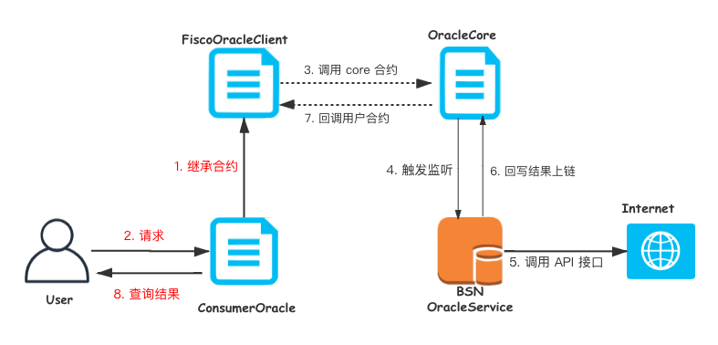

# 预言机服务

 

 
#### 1.1 概述
   
   区块链是一个确定性的、封闭的系统环境，智能合约不管何时何地运行都必须是一致的结果，所以虚拟机（VM）不能让智能合约有 network call（网络调用），不然结果就是不确定的。  
   智能合约不能直接获取到链外真实世界的数据，导致区块链与现实世界是割裂的。
   而如何将区块链和现实世界连接起来，就需要引入预言机服务，通过预言机将现实世界的数据输入到区块链上，为智能合约提供与外部世界的连接性。  
   Trustoracle是[FISCO-BCOS](https://github.com/FISCO-BCOS/FISCO-BCOS)区块链平台的预言机服务解决方案。是在广泛调研的基础上针对联盟链场景设计的预言机服务。  
       
   Trustoracle预言机主要分为链上部分和链下部分。
   链上部分主要是oracle相关合约，链下部分主要是java服务，负责监听合约的事件，采集结果并回写到oracle合约。如下图所示：     
                
#### 1.2 作用
  保险方面，航空延误险,农作物保险,天气险等，智能合约根据协议对保险产品作出是否理赔的决策。  
  金融方面，获取汇率或者资产价格，智能合约以此来确定参与各方的收益和损失，以及触发平仓交易。  
  游戏/预测市场方面，获取链上安全的随机数，智能合约以此来分配奖金。  
  物联网方面：对于IoT应用，将传感器信息上链，智能合约验证并触发下一步的行为。  

#### 1.3 特性
 `Trustoracle`目前已支持汇率，随机数，天气信息等的外部数据获取，主要特性如下：  
 - 支持API访问链下数据源
 - 支持国密
 - 支持集群部署
 - 支持多链多群组
 - 支持多数据格式访问
 - 支持请求状态查询  
  `Trustoracle`还在不断开发和探索新功能，后续会增加对VRF的支持，请求加密，返回数据验证等功能特性。    
  也欢迎参与到Trustoracle的共建当中。
  
#### 1.4  用户开发指南  
   [快速开发自己的预言机](doc/develop-bsn.md)

