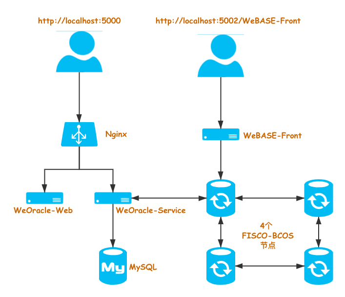

# TrustOracle Docker 部署

**提示：** 使用 Docker 部署 TrustOracle 服务时，**当前仅支持 `Linux` 操作系统！！**

##  部署架构
TrustOracle 服务支持使用 Docker 进行部署和运行。

同时，在部署 TrustOracle 服务时，会同时部署一个 WeBASE-Front（Solidity 合约的开发和调试环境）服务，作为 Oracle 的开发和调试环境。

TrustOracle 使用 Docker 模式的部署结构如下：




* **WeBASE-Front**

    WeBASE-Front 是 [WeBASE](https://webasedoc.readthedocs.io/zh_CN/latest/docs/WeBASE-Front/README.html) 的一个子系统服务，针对 FISCO-BCOS 区块链服务提供 Solidity 合约的可视化开发，编译，部署和调试功能。
    在进行 TrustOracle 相关业务的合约开发和调试时，可以使用 WeBASE-Front 中的合约 IDE，方便合约的开发和调试，大大提高开发效率。

* **TrustOracle-Web**
    
    TrustOracle-Web 是 TrustOracle 服务的前端 Web，主要包含四个功能：
    * 分页查询 Oracle 请求历史记录
    * 单个查询 Oracle 请求明细（请求状态），
    * TrustOracle-Service 内置合约地址查询
    * 查询所有 TrustOracle-Service 服务列表

* **TrustOracle-Service**

    TrustOracle-Service 是 TrustOracle 的服务端：
    * 监听 FISCO-BCOS 链上 TrustOracle 合约的事件
    * 接收链上事件，调用 Http API 接口或 VRF 随机数生成库，获取结果
    * 结果上链，供用户合约查询
    
    具体，关于 TrustOracle 原理，请参考：[Oracle-Service 原理介绍](../README.md#原理简介)


## 部署
### 系统要求

| 操作系统         |  版本最低要求     |  
| ------------- |:-------|
| CentOS|7.3（kernel >= 3.10.0-514）|
| RHEL(Red Hat)| 7.3（kernel >= 3.10.0-514）|
|Debian|Stretch 9  |
|Ubuntu|Xenial 16.04 (LTS)|


### 硬件配置

|配置项      | 推荐配置 |
|------------- | -----|
| CPU | 2 核|
| 内存 | 4 GB |
| 存储 | 40 GB |


### 一键部署脚本
TrustOracle Docker 模式部署，提供一键脚本 `deploy.sh` 部署工具：

* 自动安装 `OpenSSL, curl, wget, Docker, Docker Compose` 等依赖服务
* 调用 FISCO-BCOS 一键部署脚本 `build_chain.sh`，部署 4 个区块链底层节点
* 部署 WeBASE-Front 服务
* 部署 WeBASE-Oracle 服务
* 国密选项

### 部署

进入 `deploy.sh` 脚本所在目录，执行命令：

```Bash
# 自动安装依赖服务，从 CDN 拉取 Docker 镜像
bash deploy.sh -d

# 自动安装依赖服务，从 Docker Hub 官方仓库拉取 Docker 镜像
bash deploy.sh -d -t docker
```

* `-d`：自动安装依赖服务
* `-t`：镜像来源，`docker` 表示从 Docker Hub 官方仓库 `https://hub.docker.com/` 拉取 Docker 镜像。


>**提示：**
>
> * 如果不使用 `-t` 参数或者使用 `-t cdn`，部署工具会从 CDN 拉取 Docker 镜像
> * 由于 Docker Hub 的网络原因，部署脚本拉取镜像的速度较慢，耗时过长，容易拉取镜像失败，推荐 **从 CDN 拉取 Docker 镜像**。
  

### 一键部署脚本参数
查看一键脚本 `deploy.sh` 的帮助文档：`bash deploy.sh -h`

```Bash
[root@host]# bash deploy.sh -h

Usage:
    deploy.sh [-g] [-t cdn|docker] [-d] [-w v1.4.2] [-f v2.6.0] [-o v0.4] [-i fiscoorg] [-h]
    -g        Use guomi, default no.
    -t        Where to get docker images, cdn or Docker hub, default cdn.
    -d        Install dependencies during deployment, default no.

    -w        WeBASE-Front version, default v1.4.2
    -f        FISCO-BCOS version, default v2.6.0.
    -o        TrustOracle version, default v0.4.
    -i        Organization of docker images, default fiscoorg.
    -h        Show help info.
```
* `-g`：使用**国密**
* `-t`：镜像来源，只有 `cdn` 和 `docker` 两个选项。默认：`cdn`
* `-d`：
    * 安装 `OpenSSL`，`curl`，`wget`，`Docker`，`Docker Compose` 等依赖服务。如不使用该参数，则不安装，默认：不安装
* `-w`：指定 WeBASE-Front 的 Docker 镜像版本，默认：`v1.4.2`
* `-f`：指定 FISCO-BCOS 的 Docker 镜像版本，默认： `v2.6.0`
* `-o`：指定 Oracle-Service 的 Docker 镜像版本，默认：`v0.4`
* `-h`：显示帮助文档

* `-i`：
    * **仅开发 TrustOracle 服务时使用**。指定 Docker 镜像的组织名称。例如指定为: `testorg`，Docker 的拉取镜像命令就变成：`docker pull testorg/trustoracle-service:${version}`。默认值：`fiscoorg`

### 启动
如果一键脚本 `deploy.sh` 执行成功后显示 `Deploy TrustOracle service SUCCESS!!` ，表示部署成功。

使用 `bash start.sh` 脚本启动 TrustOracle 服务。

### 停止
使用 `bash stop.sh` 脚本停止 TrustOracle 服务。
